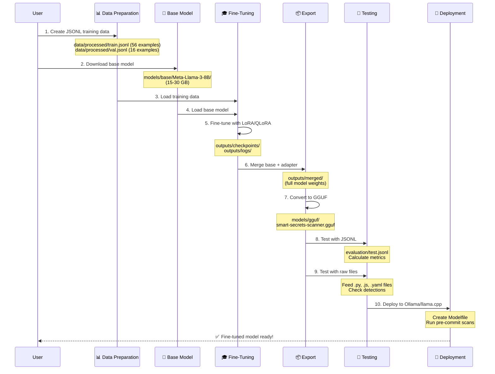

# Smart-Secrets-Scanner

**Fine-tuned Llama 3.1 model designed to detect accidental hardcoded secrets and credentials in source code**

> **Note:** Repository folder is currently named `Llama3-FineTune-Coding` but project name is **Smart Secrets Scanner**. Folder can be renamed later without affecting functionality.

## Project Overview
This project fine-tunes Llama 3 8B to detect hardcoded secrets and credentials in source code (API keys, tokens, passwords, etc.). It leverages the [ML-Env-CUDA13](https://github.com/bcgov/ML-Env-CUDA13) environment for GPU-accelerated training with LoRA/QLoRA.

## Prerequisites
- [ML-Env-CUDA13](https://github.com/bcgov/ML-Env-CUDA13) cloned at the same level as this project
- WSL2 (Ubuntu) with NVIDIA GPU drivers
- Python 3.10+ (managed by ML-Env-CUDA13)
- **Install ML-Env-CUDA13 dependencies before running fine-tuning scripts**

### One-time activities

#### 1. ensure in windows you have ubuntu and WSL setup
see [tasks\done\01-setup-wsl2-ubuntu.md](tasks\done\01-setup-wsl2-ubuntu.md)

#### 2. install NVDIA cuda drivers 
see [tasks\done\02-install-nvidia-cuda-drivers.md](tasks\done\02-install-nvidia-cuda-drivers.md)

#### 3. clone and run the ml environment 
see [tasks\done\03-clone-ml-env-cuda13.md](tasks\done\03-clone-ml-env-cuda13.md)
see [tasks\done\04-run-ml-env-setup.md](tasks\done\04-run-ml-env-setup.md)
```bash
bash ../ML-Env-CUDA13/setup_ml_env_wsl.sh
```

### restarting sessions enabling your environment
```bash
source ~/ml_env/bin/activate
python ../ML-Env-CUDA13/test_pytorch.py
python ../ML-Env-CUDA13/test_tensorflow.py
```

---

## Fine-tuning overview

### Complete Fine-Tuning Workflow



### Step-by-Step Process

> **⚠️ Note on Datasets**: Training data files (`.jsonl`) are **intentionally excluded** from this repository via `.gitignore` to avoid triggering GitHub's secret scanning on example secrets. The dataset structure and templates are documented in `data/README.md`. You can generate your own training data using the provided validation script.

#### **Phase 1: Data Preparation** 📊
1. **Create JSONL training data** → `data/processed/smart-secrets-scanner-train.jsonl`
   - 56 examples with instruction/input/output format
   - Covers secrets (AWS, Stripe, GitHub tokens) and safe patterns (env vars, test data)
2. **Create JSONL validation data** → `data/processed/smart-secrets-scanner-val.jsonl`
   - 16 examples for monitoring training progress
3. **(Optional) Create test files** → `data/evaluation/` or `data/raw/`
   - Complete source files (.py, .js, .yaml) for testing

#### **Phase 2: Model Fine-Tuning** 🎓
4. **Download base model** → `models/base/Meta-Llama-3-8B/`
   - From Hugging Face (requires auth token)
   - 15-30 GB download
5. **Fine-tune with LoRA/QLoRA** → Creates adapter in `models/fine-tuned/`
   - Use Unsloth or TRL for efficient training
   - 3-5 epochs on training data
   - Monitor validation loss
6. **Review training logs** → `outputs/logs/`
   - Check loss curves, learning rate, metrics

#### **Phase 3: Model Export** 📦
7. **Merge base model + LoRA adapter** → `outputs/merged/`
   - Combine base weights with fine-tuned adapter
   - Creates full model ready for inference
8. **Convert to GGUF format** → `models/gguf/smart-secrets-scanner.gguf`
   - Use llama.cpp converter
   - Optimized for CPU/GPU inference
9. **Quantize GGUF** (optional)
   - Q4_K_M (smaller, faster), Q8_0 (larger, more accurate)

#### **Phase 4: Testing & Deployment** 🧪🚀
10. **Test with evaluation JSONL** → Calculate precision, recall, F1 score
11. **Test with raw files** → Feed complete .py/.js/.yaml files to model
12. **Deploy to Ollama** → Create Modelfile, import GGUF, run locally
13. **Integrate with pre-commit hooks** → Scan code before git commits

---

### Folder Structure
```
Llama3-FineTune-Coding/
├── adrs/                           # Architecture Decision Records
├── scripts/                        # Bash scripts for setup, training, inference
├── notebooks/                      # Jupyter notebook templates
├── tasks/                          # Task tracking (backlog, in-progress, done)
├── data/                           # Training and evaluation datasets
│   ├── raw/                        # Original unprocessed data
│   ├── processed/                  # JSONL training data (put your .jsonl files here)
│   └── evaluation/                 # Test sets and benchmarks
├── models/                         # Model files
│   ├── base/                       # Base pre-trained models (downloaded)
│   ├── fine-tuned/                 # Fine-tuned adapters (LoRA/QLoRA)
│   └── gguf/                       # Quantized models for deployment
├── outputs/                        # Training outputs
│   ├── checkpoints/                # Training checkpoints
│   ├── logs/                       # Training logs and metrics
│   └── merged/                     # Merged models (base + adapter)
├── .gitignore                      # Excludes large model files and sensitive data
└── README.md                       # Project documentation
```

**Key directories for your Smart Secrets Scanner use case:**
- **`data/processed/`** → Put your JSONL training data here (e.g., `smart-secrets-scanner-train.jsonl`)
- **`models/base/`** → Base model downloads (e.g., Llama 3 8B)
- **`models/fine-tuned/`** → Your trained LoRA adapters
- **`models/gguf/`** → Quantized models ready for Ollama deployment

---

### CLI Scripts for workflow

#### Approach 1: CLI Scripts (Production Workflow)

**Best for**: Automation, reproducibility, CI/CD pipelines, production deployment

#### Quick Start - CLI

```bash
# Phase 1: Data Preparation (Steps 1-3)
# Step 1: JSONL training data already created ✅
# Step 2: Download base model
bash scripts/download_model.sh

# Step 3: Validate training data
python scripts/validate_dataset.py data/processed/smart-secrets-scanner-train.jsonl

# Phase 2: Model Fine-Tuning (Steps 4-6)
# Step 4: Setup environment
bash scripts/setup_env.sh
bash scripts/install_deps.sh

# Step 5: Fine-tune with LoRA
python scripts/fine_tune.py

# Step 6: Review training logs
tensorboard --logdir outputs/logs

# Phase 3: Model Export (Steps 7-9)
# Step 7: Merge base + adapter
python scripts/merge_adapter.py

# Step 8: Convert to GGUF
python scripts/convert_to_gguf.py

# Step 9: Quantize (automatic in step 8)

# Phase 4: Testing & Deployment (Steps 10-13)
# Step 10: Test with evaluation JSONL
python scripts/evaluate.py

# Step 11: Test with raw files
python scripts/inference.py --batch data/raw/

# Step 12: Deploy to Ollama
python scripts/create_modelfile.py
ollama create smart-secrets-scanner -f Modelfile

# Step 13: Integrate with pre-commit hooks
python scripts/scan_secrets.py --file examples/test.py
```

📖 **For detailed CLI instructions, see [EXECUTION_GUIDE.md](EXECUTION_GUIDE.md)**  
📋 **For quick command reference, see [QUICK_REFERENCE.md](QUICK_REFERENCE.md)**

---

## Approach 2: Jupyter Notebooks (Interactive Workflow)

**Best for**: Learning, experimentation, data exploration, iterative development

### Quick Start - Notebooks

Open and run notebooks in order:

1. **`notebooks/01_data_exploration.ipynb`** (Phase 1: Steps 1-3)
   - Inspect and validate JSONL training data
   - Analyze class balance and examples
   - Visualize dataset statistics

2. **`notebooks/02_fine_tuning_interactive.ipynb`** (Phase 2: Steps 4-6)
   - Setup environment and download model
   - Fine-tune with real-time progress tracking
   - Visualize loss curves and metrics

3. **`notebooks/03_model_evaluation.ipynb`** (Phase 3-4: Steps 7-11)
   - Merge adapter and convert to GGUF
   - Run comprehensive evaluation
   - Test inference on code samples

4. **`notebooks/04_deployment_testing.ipynb`** (Phase 4: Steps 12-13)
   - Create Modelfile and deploy to Ollama
   - Test pre-commit scanning workflow
   - Validate production deployment

📓 **Interactive learning path - run cells sequentially for guided workflow**

---

## Project Structure

- **`scripts/`** - Shell and Python scripts for training and deployment
- **`config/`** - Configuration files (training hyperparameters)
- **`data/`** - Training datasets (JSONL format)
- **`models/`** - Base models, fine-tuned adapters, and GGUF exports
- **`outputs/`** - Training checkpoints, logs, and merged models
- **`tasks/`** - Task tracking and project management

## Key Scripts

| Script | Purpose | Task |
|--------|---------|------|
| `scripts/fine_tune.py` | Train LoRA adapter | Task 36 |
| `scripts/merge_adapter.py` | Merge adapter with base model | Task 38 |
| `scripts/convert_to_gguf.py` | Convert to GGUF format | Task 39 |
| `scripts/evaluate.py` | Calculate metrics | Task 32 |
| `scripts/scan_secrets.py` | Pre-commit scanning | Task 41 |

See [SCRIPTS_TASKS_MAPPING.md](SCRIPTS_TASKS_MAPPING.md) for complete script documentation.

## Documentation

- **[EXECUTION_GUIDE.md](EXECUTION_GUIDE.md)** - Step-by-step execution instructions
- **[SCRIPTS_TASKS_MAPPING.md](SCRIPTS_TASKS_MAPPING.md)** - Scripts to tasks mapping
- **[data/README.md](data/README.md)** - Data folder structure and workflow
- **[tasks/](tasks/)** - Task tracking (backlog, in-progress, done)
- **[adrs/](adrs/)** - Architecture Decision Records

## Notes
- All scripts designed for Bash/WSL2 (not PowerShell/Windows CMD)
- Training data ready: 72 examples (56 train, 16 validation)
- Next: Create test dataset and begin fine-tuning

---
