# Smart-Secrets-Scanner

## Project Overview and Repo Purpose
This project fine‑tunes Meta Llama 3.1 (8B) using LoRA/QLoRA to detect accidental hardcoded secrets (API keys, tokens, passwords, etc.) in source code. It uses a comprehensive WSL/CUDA environment setup for GPU‑accelerated training and deterministic inference.

**🚀 Systematic Workflow Execution**: Following the `CUDA-ML-ENV-SETUP.md` protocol, we've successfully completed environment setup, dataset preparation (72 examples), base model download (15-30GB), and are currently executing LoRA fine-tuning. The project uses a task-based tracking system with real-time git commits to maintain reproducible progress.

**🎯 Current Status (November 2025)**: Actively executing Phase 2 of the workflow - LoRA fine-tuning is running in WSL with structured logging and checkpointing. Next steps: adapter merging → GGUF conversion → Ollama deployment.

The repository provides a reproducible pipeline and scripts to prepare JSONL datasets, train adapters, merge and export models (GGUF), run evaluations, and deploy to runtimes such as Ollama or Hugging Face. This project demonstrates systematic GPU‑accelerated fine‑tuning with comprehensive task tracking and follows BC Gov licensing and governance guidance.

> ⚠️ Important: this repository is a demonstration and research project. The embedded "Smart Secrets Scanner" examples are intended for experimentation and testing of CUDA-accelerated fine-tuning only. They are not a production-grade secret-scanning solution and must not be used as a replacement for established commercial or enterprise secret-scanning tools (for example, Snyk or Wiz). Use this project to learn and validate model workflows, and rely on proven scanning products for operational security.

## Prerequisites
- **WSL2 (Ubuntu)** with NVIDIA GPU drivers (latest version)
- **Python 3.11** (managed by our custom setup)
- **CUDA 12.6** with PyTorch 2.9.0+cu126
- **Git LFS** for large file handling
- **Hugging Face account** with access token for model downloads

### CUDA ML Environment Setup — Recommended Approach

This repository uses a comprehensive, validated setup protocol documented in `CUDA-ML-ENV-SETUP.md`. Our approach provides deterministic CUDA environment creation with surgical binary installations for optimal performance.

**Key Dependencies (Validated November 2025):**
- **PyTorch**: 2.9.0+cu126 (CUDA-enabled)
- **Transformers**: Latest compatible version
- **PEFT**: For LoRA/QLoRA fine-tuning
- **BitsAndBytes**: 0.48.2 (CUDA 12.6 native support)
- **Accelerate**: For distributed training
- **TRL**: For supervised fine-tuning
- **Llama.cpp**: Built with GGML_CUDA=ON for GPU acceleration

Recommended install approach (validated protocol):

1. **Start with clean slate** (remove any old environments):
```bash
deactivate 2>/dev/null || true
rm -rf ~/ml_env
```

2. **Run our validated setup script** (requires sudo for system packages):
```bash
sudo python3 scripts/setup_cuda_env.py --staged --recreate
```

3. **Execute surgical CUDA binary installations** (critical for performance):
```bash
source ~/ml_env/bin/activate
# Follow the "Surgical Strike" protocol in CUDA-ML-ENV-SETUP.md
# Installs: bitsandbytes 0.48.2, triton 3.5.0, xformers with CUDA support
```

4. **Verify complete environment**:
```bash
source ~/ml_env/bin/activate
python scripts/test_torch_cuda.py
python scripts/test_pytorch.py
python scripts/test_xformers.py
python scripts/test_llama_cpp.py
```

5. **Install Git LFS**:
```bash
sudo apt update && sudo apt install git-lfs
git lfs install
```

### One-time activities

#### 1. ensure in windows you have ubuntu and WSL setup
see [tasks\done\01-setup-wsl2-ubuntu.md](tasks\done\01-setup-wsl2-ubuntu.md)

#### 2. install NVDIA cuda drivers 
see [tasks\done\02-install-nvidia-cuda-drivers.md](tasks\done\02-install-nvidia-cuda-drivers.md)

#### 3. clone and run the ml environment 
see [tasks\done\03-clone-ml-env-cuda13.md](tasks\done\03-clone-ml-env-cuda13.md)
see [tasks\done\04-run-ml-env-setup.md](tasks\done\04-run-ml-env-setup.md)
```bash
```bash
sudo python3 scripts/setup_cuda_env.py --staged --recreate
```

3. Activate the new environment and verify:

```bash
source ~/ml_env/bin/activate
python scripts/test_torch_cuda.py
python scripts/test_xformers.py
python scripts/test_tensorflow.py
python scripts/test_pytorch.py
python scripts/test_llama_cpp.py
```
```

### restarting sessions enabling your environment
```bash
source ~/ml_env/bin/activate
python scripts/test_torch_cuda.py
python scripts/test_xformers.py
python scripts/test_tensorflow.py
python scripts/test_pytorch.py
python scripts/test_llama_cpp.py
```

---

## Fine-tuning overview

### Complete Fine-Tuning Workflow

```mermaid
sequenceDiagram
    participant User
    participant Data as 📊 Data Preparation
    participant Base as 🔽 Base Model
    participant Train as 🎓 Fine-Tuning
    participant Export as 📦 Export
    participant Test as 🧪 Testing
    participant Deploy as 🚀 Deployment

    User->>Data: 1. Create JSONL training data
    Note over Data: data/processed/smart-secrets-scanner-dataset.jsonl<br/>(72 validated examples - LLM-driven generation)
    
    User->>Base: 2. Download base model
    Note over Base: models/base/Meta-Llama-3.1-8B/<br/>(15-30 GB from Hugging Face)
    
    Data->>Train: 3. Load training data
    Base->>Train: 4. Load base model
    Train->>Train: 5. Fine-tune with LoRA/QLoRA
    Note over Train: outputs/checkpoints/<br/>outputs/logs/ (currently running)
    
    Train->>Export: 6. Merge base + adapter
    Note over Export: models/merged/<br/>(full model weights)
    
    Export->>Export: 7. Convert to GGUF
    Note over Export: models/gguf/<br/>smart-secrets-scanner.gguf
    
    Export->>Test: 8. Test with JSONL
    Note over Test: evaluation/test.jsonl<br/>Calculate precision/recall/F1
    
    Export->>Test: 9. Test with raw files
    Note over Test: Feed .py, .js, .yaml files<br/>Check secret detections
    
    Test->>Deploy: 10. Deploy to Ollama/llama.cpp
    Note over Deploy: Create Modelfile<br/>Run pre-commit scans
    
    Deploy-->>User: ✅ Fine-tuned model ready!
```



## Workflow Overview


### Step-by-Step Process

> **⚠️ Note on Datasets**: Training data files (`.jsonl`) are **intentionally excluded** from this repository via `.gitignore` to avoid triggering GitHub's secret scanning on example secrets. The dataset structure and templates are documented in `data/README.md`. You can generate your own training data using the provided validation script.

#### **Phase 1: Data Preparation** 📊
1. **Create JSONL training data** → `data/processed/smart-secrets-scanner-dataset.jsonl`
   - **72 validated examples** with instruction/input/output format (LLM-driven generation)
   - Covers secrets (AWS, Stripe, GitHub tokens, API keys) and safe patterns (env vars, test data)
   - **Architecture Decision Record**: See `adrs/0007-llm-driven-dataset-creation.md`
2. **Validate training dataset** → Comprehensive quality checks
   - Schema validation, balance verification, secret pattern coverage

#### **Phase 2: Model Fine-Tuning** 🎓
4. **Download base model** → `models/base/Meta-Llama-3.1-8B/`
   - ✅ **Completed**: Successfully downloaded 15-30GB from Hugging Face
   - Uses authenticated token from `.env` file
5. **Fine-tune with LoRA/QLoRA** → Creates adapter in `models/fine-tuned/`
   - 🔄 **Currently Running**: `python scripts/fine_tune.py` executing in WSL
   - **Production script** with system diagnostics, checkpoint resume, and structured logging
   - **Optimized configuration**: 4-bit quantization, LoRA r=16, alpha=32, dropout=0.05
   - **Real-time monitoring**: `tail -f outputs/logs/training.log`
   - Expected completion: 1-3 hours on RTX 30-series GPU
6. **Review training logs** → `outputs/logs/` (available during/after training)
   - Loss curves, validation metrics, GPU utilization tracking

#### **Phase 3: Model Export** 📦
7. **Merge base model + LoRA adapter** → `models/merged/`
   - Combine base weights with fine-tuned adapter
   - Creates full model ready for inference
8. **Convert to GGUF format** → `models/gguf/smart-secrets-scanner.gguf`
   - Use llama.cpp converter
   - Optimized for CPU/GPU inference
9. **Quantize GGUF** (optional)
   - Q4_K_M (smaller, faster), Q8_0 (larger, more accurate)

#### **Phase 4: Testing & Deployment** 🧪🚀
10. **Test with evaluation JSONL** → Calculate precision, recall, F1 score
11. **Test with raw files** → Feed complete .py/.js/.yaml files to model
12. **Deploy to Ollama** → Create Modelfile, import GGUF, run locally
13. **Integrate with pre-commit hooks** → Scan code before git commits

---

## Current Project Status (November 2025)

### ✅ **Completed Phases**
- **Phase 0**: Repository setup, WSL configuration, NVIDIA drivers, llama.cpp build
- **Phase 1**: Environment setup with `setup_cuda_env.py`, surgical CUDA binary installations
- **Phase 1**: Dataset creation (72 examples via LLM-driven approach), validation completed
- **Phase 2**: Base model download (Llama-3.1-8B, 15-30GB) successfully completed

### 🔄 **Currently Executing**
- **Phase 2**: LoRA fine-tuning actively running in WSL terminal
- **Real-time progress**: Loading base model → configuring 4-bit quantization → training loop
- **Monitoring**: `tail -f outputs/logs/training.log`
- **Expected completion**: 1-3 hours depending on GPU

### 📋 **Next Steps (Pending Fine-tuning Completion)**
- **Phase 2**: Merge LoRA adapter with base model
- **Phase 3**: Convert merged model to GGUF format (Q4_K_M quantization)
- **Phase 3**: Create Ollama Modelfile and test deployment
- **Phase 4**: Comprehensive evaluation and Hugging Face upload

### 📊 **Key Metrics**
- **Dataset**: 72 validated training examples (JSONL format)
- **Model**: Llama-3.1-8B base with LoRA fine-tuning (r=16, alpha=32)
- **Hardware**: RTX 30-series GPU with CUDA 12.6
- **Environment**: Python 3.11, PyTorch 2.9.0+cu126

### 📝 **Task Tracking**
All progress tracked in `tasks/` directory with real-time git commits:
- ✅ Tasks 58-67: Environment setup and model preparation
- 🔄 Task 68: Fine-tuning (in progress)
- 📋 Tasks 69-74: Post-training workflow (pending)

---

### Folder Structure
```
Smart-Secrets-Scanner/
├── adrs/                           # Architecture Decision Records
├── scripts/                        # Bash scripts for setup, training, inference
├── notebooks/                      # Jupyter notebook templates
├── tasks/                          # Task tracking (backlog, in-progress, done)
├── data/                           # Training and evaluation datasets
│   ├── raw/                        # Original unprocessed data
│   ├── processed/                  # JSONL training data (put your .jsonl files here)
│   └── evaluation/                 # Test sets and benchmarks
├── models/                         # Model files
│   ├── base/                       # Base pre-trained models (downloaded)
│   ├── fine-tuned/                 # Fine-tuned adapters (LoRA/QLoRA)
│   ├── merged/                     # Merged models (base + adapter)
│   └── gguf/                       # Quantized models for deployment
├── outputs/                        # Training outputs
│   ├── checkpoints/                # Training checkpoints
│   ├── logs/                       # Training logs and metrics
│   └── temp/                       # Temporary files during training
├── .gitignore                      # Excludes large model files and sensitive data
└── README.md                       # Project documentation
```
```

**Key directories for your Smart Secrets Scanner use case:**
- **`data/processed/`** → Put your JSONL training data here (e.g., `smart-secrets-scanner-train.jsonl`)
- **`models/base/`** → Base model downloads (e.g., [Llama 3.1 8B](https://huggingface.co/meta-llama/Llama-3.1-8B))
- **`models/fine-tuned/`** → Your trained LoRA adapters
- **`models/merged/`** → Merged full models (base + adapter)
- **`models/gguf/`** → Quantized models ready for Ollama deployment

---

### CLI Scripts for workflow

#### Approach 1: CLI Scripts (Production Workflow)

**Best for**: Automation, reproducibility, CI/CD pipelines, production deployment

#### Quick Start - CLI

```bash
# Phase 1: Environment & Data Preparation (Completed ✅)
# Step 1: Environment setup completed with setup_cuda_env.py
# Step 2: Dataset created and validated (72 examples)
# Step 3: Base model downloaded successfully

# Phase 2: Model Fine-Tuning (Currently Running 🔄)
# Step 4: Fine-tuning in progress
python scripts/fine_tune.py  # Currently executing in WSL

# Step 5: Monitor training progress
tail -f outputs/logs/training.log

# Phase 3: Model Export (Next Steps 📋)
# Step 6: Merge adapter with base model
python scripts/merge_adapter.py --skip-sanity

# Step 7: Convert to GGUF format
python scripts/convert_to_gguf.py --quant Q4_K_M --force

# Step 8: Create Ollama Modelfile
python scripts/create_modelfile.py

# Step 9: Deploy to Ollama
ollama create smart-secrets-scanner -f Modelfile
ollama run smart-secrets-scanner

# Phase 4: Testing & Publishing
# Step 10: Run comprehensive evaluation
python scripts/evaluate.py

# Step 11: Upload to Hugging Face
python scripts/upload_to_huggingface.py --repo yourusername/smart-secrets-scanner --gguf --modelfile --readme
```
python scripts/merge_adapter.py

# Step 8: Convert to GGUF
python scripts/convert_to_gguf.py

# Step 9: Quantize (automatic in step 8)

# Phase 4: Testing & Deployment (Steps 10-13)
# Step 10: Test with evaluation JSONL
python scripts/evaluate.py

# Step 11: Test with raw files
python scripts/inference.py --batch data/raw/

# Step 12: Deploy to Ollama
python scripts/create_modelfile.py
ollama create smart-secrets-scanner -f Modelfile

# Step 13: Integrate with pre-commit hooks
python scripts/scan_secrets.py --file examples/test.py
```

### Important note: local GGUF vs deployed model differences

If you see differing behaviour between a locally-run GGUF model (for example, running with `ollama run` or a local gguf file) and a model referenced via a Modelfile that points to a Hugging Face-deployed version, this is expected to sometimes occur — and is important to document:

- Observed: the local GGUF model produced correct/expected detections, but switching the Modelfile to point at the Hugging Face hosted model produced different outputs (fewer alerts / different classification).

Possible causes and quick checklist to diagnose:

1. Model variant mismatch: ensure the Modelfile `FROM` path references the exact same model and revision you tested locally (same commit/gguf file). A different model ID, revision, or quantization will change outputs.
2. Quantization and format: local GGUF may be quantized (Q4/K/M etc.); the deployed HF model may be a different numeric format (FP16, FP32) or different tokenizer settings.
3. Tokenizer / special tokens: confirm the tokenizer and special tokens are identical. Small tokenizer differences change prompts and results.
4. Generation/config differences: check temperature, top_p, seed, max_new_tokens, and any system/prompt wrappers used by the hosted deployment.
5. Prompt formatting and instruction wrapper: some deployments add instruction/system wrappers or strip newlines. Compare the exact prompt payload you send locally vs to HF endpoint.
6. Merge step: verify you merged the LoRA adapter into the base correctly for the deployed model (or that the hosted model already includes the adapter weights).
7. Environment and runtime differences: model serving infra (batching, safety filters, or post-processing) can change outputs.

Suggested reproduction steps:

1. Save the exact prompt you used locally (including wrappers).
2. Run a deterministic local inference with a fixed seed and generation params and save the response.
3. Call the hosted model with the identical prompt and generation parameters (where possible) and compare responses.
4. If outputs differ, check the model revision, tokenizer files, and Modelfile `FROM` line. Also compare any Modelfile-run-time environment variables or post-processing steps.

If you'd like, I can add a small troubleshooting section to `EXECUTION_GUIDE.md` with exact curl/examples for calling the HF endpoint and `ollama run` side-by-side to make this comparison repeatable.

📖 **For detailed CLI instructions, see [EXECUTION_GUIDE.md](EXECUTION_GUIDE.md)**  
📋 **For quick command reference, see [QUICK_REFERENCE.md](QUICK_REFERENCE.md)**

---

## Approach 2: Jupyter Notebooks (Interactive Workflow)

**Best for**: Learning, experimentation, data exploration, iterative development

> ⚠️ NOTE: The notebooks in `notebooks/` are provided as illustrative examples only. The project’s tested and validated workflow uses the scripts in the `scripts/` folder (for example, `scripts/fine_tune.py`, `scripts/validate_dataset.py`, `scripts/evaluate.py`). I have exercised the scripts-based approach locally (path example: `C:\Users\RICHFREM\source\repos\Smart-Secrets-Scanner\scripts`) — the notebooks themselves have not been executed or validated as part of the current tests. Use the notebooks for exploration only and prefer the scripts for reproducible runs.
⚠️ NOTE: The notebooks in `notebooks/` are provided as illustrative examples only. The project’s tested and validated workflow uses the scripts in the `scripts/` folder (for example, `scripts/fine_tune.py`, `scripts/validate_dataset.py`, `scripts/evaluate.py`). I have exercised the scripts-based approach locally (path example: `./scripts`) — the notebooks themselves have not been executed or validated as part of the current tests. Use the notebooks for exploration only and prefer the scripts for reproducible runs.

### Quick Start - Notebooks

Open and run notebooks in order:

1. **`notebooks/01_data_exploration.ipynb`** (Phase 1: Steps 1-3)
   - Inspect and validate JSONL training data
   - Analyze class balance and examples
   - Visualize dataset statistics

2. **`notebooks/02_fine_tuning_interactive.ipynb`** (Phase 2: Steps 4-6)
   - Setup environment and download model
   - Fine-tune with real-time progress tracking
   - Visualize loss curves and metrics

3. **`notebooks/03_model_evaluation.ipynb`** (Phase 3-4: Steps 7-11)
   - Merge adapter and convert to GGUF
   - Run comprehensive evaluation
   - Test inference on code samples

4. **`notebooks/04_deployment_testing.ipynb`** (Phase 4: Steps 12-13)
   - Create Modelfile and deploy to Ollama
   - Test pre-commit scanning workflow
   - Validate production deployment

📓 **Interactive learning path - run cells sequentially for guided workflow**

---

## Project Structure

- **`scripts/`** - Shell and Python scripts for training and deployment
- **`config/`** - Configuration files (training hyperparameters)
- **`data/`** - Training datasets (JSONL format)
- **`models/`** - Base models, fine-tuned adapters, and GGUF exports
- **`outputs/`** - Training checkpoints, logs, and merged models
- **`tasks/`** - Task tracking and project management

## Key Scripts

| Script | Purpose | Task |
|--------|---------|------|
| `scripts/fine_tune.py` | Train LoRA adapter | Task 36 |
| `scripts/merge_adapter.py` | Merge adapter with base model | Task 38 |
| `scripts/convert_to_gguf.py` | Convert to GGUF format | Task 39 |
| `scripts/evaluate.py` | Calculate metrics | Task 32 |
| `scripts/scan_secrets.py` | Pre-commit scanning | Task 41 |

See [SCRIPTS_TASKS_MAPPING.md](SCRIPTS_TASKS_MAPPING.md) for complete script documentation.

## Documentation

- **[EXECUTION_GUIDE.md](EXECUTION_GUIDE.md)** - Step-by-step execution instructions
- **[SCRIPTS_TASKS_MAPPING.md](SCRIPTS_TASKS_MAPPING.md)** - Scripts to tasks mapping
- **[data/README.md](data/README.md)** - Data folder structure and workflow
- **[tasks/](tasks/)** - Task tracking (backlog, in-progress, done)
- **[adrs/](adrs/)** - Architecture Decision Records

## Governance, licensing and repository requirements

This repository is published under the Apache License 2.0. The following items are recommended or required for BC Government GitHub repositories and our internal policies:

- Include a `LICENSE` file at the repository root (this project already contains `LICENSE` — Apache-2.0).
- Keep a short license/footer in top-level documentation (see footer at the bottom of this README).
- Add an Apache license header to distributed source files (scripts, Python files, etc.). See the `LICENSE` file for the exact wording. A short example header to include near the top of scripts is:

```text
Copyright 2025 British Columbia

Licensed under the Apache License, Version 2.0 (the "License");
you may not use this file except in compliance with the License.
You may obtain a copy of the License at

   http://www.apache.org/licenses/LICENSE-2.0
```

If you run CI checks, add a check to ensure new/modified source files include the required header.

Prefer referencing repository-provided verification scripts rather than generic commands. See "Verify the environment & scripts" below.

## Verify the environment & scripts

Prefer the repository-provided verification scripts rather than generic instructions. Common checks and commands:

WSL / ML-Env verification (ML-Env-CUDA13 sibling repo)
```bash
# from inside WSL with the unified environment
source ~/ml_env/bin/activate
python scripts/test_pytorch.py
python scripts/test_tensorflow.py
```

If you are installing in WSL, run `pip install -r requirements-wsl.txt` (see `CUDA-ML-ENV-SETUP.md` for the recommended staged install). The top-level `requirements.txt` is intended as a portable list; for CUDA-enabled installs prefer `requirements-wsl.txt`.

Repository-specific verification
```bash
# Setup and install dependencies (WSL/Bash)
bash scripts/setup_env.sh
bash scripts/install_deps.sh

# Validate training data
python scripts/validate_dataset.py data/processed/smart-secrets-scanner-train.jsonl

# Run evaluation (after training/merge)
python scripts/evaluate.py --test-data data/evaluation/smart-secrets-scanner-test.jsonl

# Run pre-commit / scanner locally against a file
python scripts/scan_secrets.py --file examples/test.py
```

If your environment requires `pytest`/`flake8`, run them after activating the CUDA-enabled ML-Env Python environment (ML-Env-CUDA13) so tests run with the correct CUDA/tooling present. For WSL/Bash:
```bash
source ~/ml_env/bin/activate
```
On Windows PowerShell (example):
```powershell
.\cuda_clean_env\Scripts\Activate
```
Prefer using repository wrapper scripts and the provided verification scripts (for example `python scripts/test_pytorch.py`) instead of relying on global installs.

---

````

---

Copyright 2025 British Columbia

Licensed under the Apache License, Version 2.0 (the "License"); you may not use this file except in compliance with the License. You may obtain a copy of the License at http://www.apache.org/licenses/LICENSE-2.0

````

## Notes
- **Environment**: All scripts designed for Bash/WSL2 (not PowerShell/Windows CMD)
- **Dependencies**: Validated with PyTorch 2.9.0+cu126, CUDA 12.6, Python 3.11
- **Dataset**: 72 validated training examples (LLM-driven generation, comprehensive secret coverage)
- **Current Status**: Fine-tuning actively running in WSL (1-3 hours remaining)
- **Task Tracking**: Comprehensive progress documented in `tasks/` with git commits
- **Next Steps**: Adapter merging → GGUF conversion → Ollama deployment → evaluation

---
