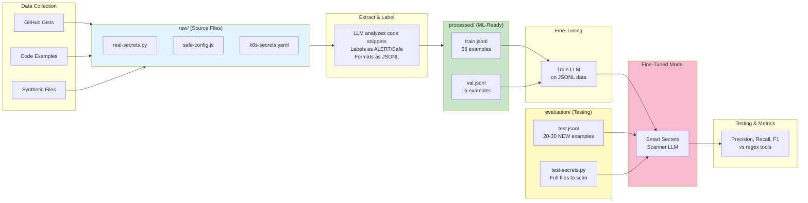

# Data Directory Structure

This directory contains all training, validation, and evaluation datasets for fine-tuning LLMs.

## Data Workflow Overview



## Terminology Note

This structure uses **data engineering conventions** (raw → processed → evaluation) rather than traditional ML conventions (train/val/test):

- **`raw/`** = Full source code files (.py, .js, .yaml) - **optional** for data collection OR useful for testing the fine-tuned model on complete files
- **`processed/`** = ML-ready training/validation sets in JSONL format (what you'd traditionally call `train/` and `val/`)
- **`evaluation/`** = Held-out test sets (equivalent to `test/` in ML)

**Two Valid Workflows:**

**Workflow A (Data Engineering - Full Pipeline):**
```
Collect code samples → raw/ → Extract snippets → processed/ → Train model
```

**Workflow B (Direct JSONL - What We Did):**
```
LLM creates labeled examples directly → processed/ → Train model
Use raw/ later for testing complete files
```

**Why this approach?**
- ✅ **LLM-driven labeling**: Uses AI judgment rather than regex patterns for nuanced secret detection
- ✅ **No extraction script**: Direct creation eliminates the need for complex parsing logic
- ✅ **Context awareness**: LLM understands programming context and edge cases
- ✅ Data provenance: Track where examples originated (if using Workflow A)
- ✅ Reproducibility: Regenerate processed data from raw sources (if using Workflow A)
- ✅ Testing: Feed complete files to fine-tuned model to simulate pre-commit scanning
- ✅ Flexibility: Support both workflows in the same structure

**Alternative (simpler) structure:** If you skip raw data collection entirely, you could use `train/`, `val/`, `test/` folders directly with JSONL files.

## Subdirectories

### `raw/`
- **Purpose**: Original, unprocessed source code files containing secrets and safe patterns before extraction
- **Contents**: Code files in various languages (.py, .js, .yaml, .go, .java, etc.) with embedded credentials, configuration files, documentation examples, and edge cases
- **Structure**:
  ```
  raw/
  ├── python-examples/
  │   ├── real-secrets.py          # True positives: actual API keys, passwords, tokens
  │   ├── false-positives.py       # True negatives: UUIDs, test data, env vars
  │   ├── obfuscated-secrets.py    # Edge cases: base64, split strings
  │   └── mixed-patterns.py        # Both safe and unsafe patterns
  ├── javascript-examples/
  │   ├── config-with-secrets.js   # Hardcoded credentials in JS
  │   ├── safe-config.js           # Environment variable usage
  │   └── api-integrations.js      # Various API key patterns
  ├── yaml-examples/
  │   ├── k8s-secrets.yaml         # Kubernetes secrets (unsafe)
  │   ├── k8s-configmap.yaml       # Config maps (safe)
  │   └── docker-compose.yml       # Mixed safe/unsafe patterns
  ├── java-examples/
  │   ├── DatabaseConfig.java      # JDBC connection strings
  │   └── ApiClient.java           # API authentication patterns
  └── edge-cases/
      ├── comments-with-keys.py    # Secrets in TODO/debug comments
      ├── url-encoded.js           # URL-encoded secrets
      └── concatenated-strings.go  # Split/concatenated credential strings
  ```
- **What to Include**:
  - **True Positives (Real Secrets)**: AWS keys, Stripe API keys, GitHub tokens, database passwords, private keys, JWT secrets, OAuth tokens
  - **True Negatives (Safe Code)**: Environment variable usage (os.getenv, process.env), test fixtures, placeholder values, public keys, UUIDs, version numbers
  - **Edge Cases**: Base64-encoded secrets, URL-encoded strings, split/concatenated credentials, secrets in comments, hardcoded fallback values
- **Sources**: GitHub gists, StackOverflow snippets, synthetic examples, sanitized production code patterns (no real credentials)

### `processed/`
- **Purpose**: Extracted training examples from raw files, formatted as JSONL for LLM fine-tuning
- **Contents**: JSONL files in Alpaca, ChatML, or other LLM training formats
- **How It's Created**: Extract code snippets from `raw/` files and convert to instruction-input-output format
- **Example Files**: `smart-secrets-scanner-train.jsonl`, `smart-secrets-scanner-val.jsonl`
- **Workflow**:
  ```
  raw/python-examples/real-secrets.py (full file)
       ↓ Extract individual examples
  processed/smart-secrets-scanner-train.jsonl (JSONL with labeled examples)
  ```
- **JSONL Format**: 
  ```jsonl
  {"instruction": "Analyze the following code snippet and identify any secrets...", "input": "stripe_key = \"sk_live_XXXXXXXXXXXXXXXXXXXX\"", "output": "ALERT: Stripe API key detected. The variable 'stripe_key' contains a Stripe live API key..."}
  {"instruction": "Analyze the following code snippet and identify any secrets...", "input": "github_token = os.getenv(\"GITHUB_TOKEN\")", "output": "No secrets detected. This code correctly retrieves a GitHub token from environment variables..."}
  ```
- **Key Point**: The "input" field contains code snippets (including synthetic secrets for training), and the "output" field contains the expected detection result. Secrets are kept in training data so the model learns to recognize them.

### `evaluation/`
- **Purpose**: Test datasets and benchmark data for model evaluation (never seen during training)
- **Contents**: Held-out test sets, human-labeled examples, benchmark datasets, and comparison results
- **Key Rule**: These examples must NOT be in `raw/` or `processed/` training data - they're for unbiased testing only
- **Example Files**: 
  - `smart-secrets-scanner-test.jsonl` - New code examples for final model testing
  - `benchmark-results.json` - Performance metrics vs. regex tools (detect-secrets, GitGuardian)
  - `false-positive-analysis.jsonl` - Edge cases that caused false alarms
  - `real-world-samples.jsonl` - Actual code patterns from production (sanitized)
- **Workflow**:
  ```
  Train model on: processed/smart-secrets-scanner-train.jsonl (56 examples)
  Validate during training: processed/smart-secrets-scanner-val.jsonl (16 examples)
  Final testing on: evaluation/smart-secrets-scanner-test.jsonl (NEW 20-30 examples)
       ↓
  Compare results: evaluation/benchmark-results.json
  ```
- **Testing Strategy**:
  - **Precision**: Of all secrets the model flagged, how many were real? (reduce false positives)
  - **Recall**: Of all real secrets, how many did the model catch? (reduce false negatives)
  - **F1 Score**: Balance of precision and recall
  - **Comparison**: Fine-tuned LLM vs. detect-secrets vs. GitGuardian vs. TruffleHog
- **Why Separate?**: Training data can be "memorized" by the model. Evaluation data tests if the model truly learned patterns vs. just memorizing examples.

## Best Practices

1. **Keep raw data**: Never delete or modify files in `raw/`. Always create processed versions in `processed/`.
2. **Version control**: Use descriptive filenames with dates or versions (e.g., `dataset-v2-2025-11-01.jsonl`).
3. **Document sources**: Add a `SOURCES.md` file to track where data came from and any licensing info.
4. **Split data**: Use train/validation/test splits (e.g., 80/10/10) for robust evaluation.
5. **Quality over quantity**: Start with 100-200 high-quality examples rather than thousands of noisy ones.

## For Smart Secrets Scanner Use Case

- **Raw**: Store example code files with secrets, false positives, edge cases
- **Processed**: JSONL with instruction/input/output format for detecting secrets in code
- **Evaluation**: Test set with known secrets and non-secrets for accuracy measurement
